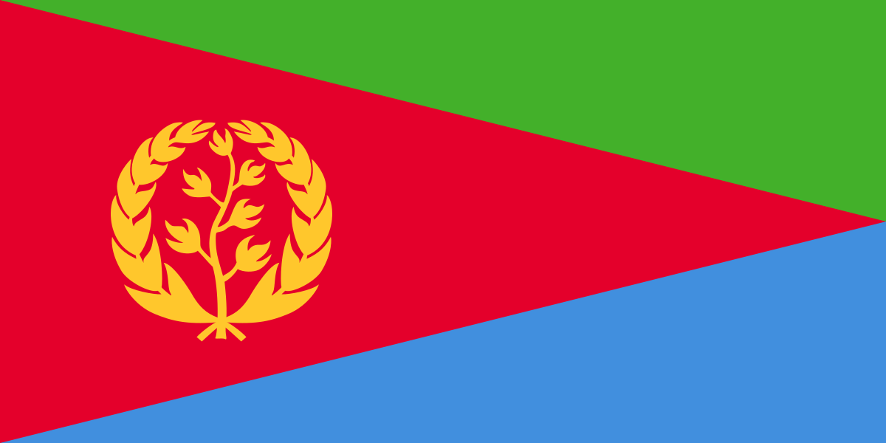

# My Profile

# My Life
---
---

---
---
### My name is Feven Haile and I am a student in the YearUp Project Managment program. I graduated from Washington State University in 2018 and graduated with a degree in Marketing. I knew marketing was never my passion and I was lost in what I wanted to do. I struggled to find a job after graduating and I knew I wanted to do a job that required helping people. I became a GPD case manager so I worked along side finding resources for veteran. It was extremely fulfulling job. Once I became a Housing Case Manager for everyone, I realized that I was a really big empath and when people are struggling, I take on there hurt. After constantly working with people in crisis, I realized it was taking a mental toll on me. I knew then, I had to look into switching career paths. Although I loved working as a case manager, I also needed financial stability. My family recommend I apply to YearUp. I had a lot of friends and family in the program before and I've only heard positive things. I knew I didnt want to go back to school for 4 years again so YearUp gave me the best if both worlds. I applied to the YearUp cohort in Septmenber but they informed me that it was closed. I was discoursged and took it as a sign to not continue. I recieved a call the next day and they informed me that they were starting a new project management course and I was elated. I was never good and coding and PM was exactly the perfect mix of business but more of the manageral side. Now I finally feel like Im doing what I was meant to be doing.
---
---
# Year Up Program Management
---
---
### 1) I'm excited for the new oppurtunities that YearUp will give me that was not available in my previous career. YearUp gave me the oppurtunity to explore a completely different industry or role that aligns more closely with my interests and passions.

### 2) Changing my career paths provides opportunities for me to network with new people and build relationships in a new industry. This helps me expand your professional network and potentially open up new job opportunities in the future.

### 3) YearUp gave me the oppurtunity for personal growth. YearUp taught me new skills, challenged me in new ways, and develop a more diverse set of experiences that will benefit me in the long run.
---
---
# Accomplishment: 
---
---
My biggest accomplishment during your Year Up journey that I am most proud of is finishing Coursera and recieving my Google Project Management Certificate.

---
# Contact 
[Feven's LinkedIn](https://www.linkedin.com/in/feven-haile-a80669261/)
